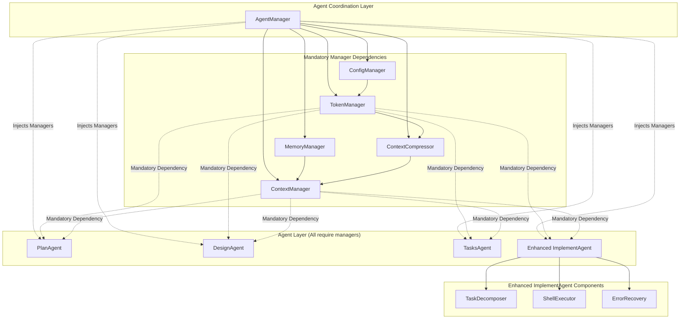

# AutoGen Multi-Agent Framework

[](https://github.com/wirelessr/SpecForge-Agent/actions/workflows/ci.yml) [](https://codecov.io/gh/wirelessr/SpecForge-Agent)

A Python-based multi-agent collaboration framework using AutoGen for project development, debugging, and code review tasks. Enhanced with autonomous execution capabilities, intelligent task decomposition, and multi-strategy error recovery.

## Features

### Core Multi-Agent Collaboration
- **Plan Agent**: Requirements analysis and specification generation
- **Design Agent**: Technical design and architecture planning
- **Tasks Agent**: Task decomposition and implementation planning
- **Enhanced Implement Agent**: Autonomous task execution with intelligent capabilities

### Autonomous Execution Enhancement
- **Intelligent Task Decomposition**: Automatically converts high-level tasks into sequential shell command interactions
- **Task-Level Error Recovery**: ImplementAgent provides sophisticated error recovery for individual tasks
- **Context-Aware Execution**: Uses comprehensive project context including requirements, design, and execution history
- **Quality-First Implementation**: Produces high-quality, maintainable code following project standards

### Advanced Components
- **TaskDecomposer**: Breaks down complex tasks into executable shell command sequences with conditional logic
- **ErrorRecovery**: Intelligent error analysis and alternative strategy generation for task execution
- **ContextManager**: Comprehensive project context integration with agent-specific interfaces
- **Quality Measurement Framework**: Objective quality metrics and continuous improvement tracking

### Infrastructure
- **Modular Architecture**: Dedicated components for session management, workflow orchestration, and task execution
- **Shell Execution**: Complete shell command execution with intelligent response handling
- **Memory System**: Persistent memory storage with cross-session learning patterns
- **Pure Text Interface**: Command-line interface for user interaction
- **Patch-First Strategy**: Intelligent file editing using diff/patch commands

## Installation

This project uses `uv` for dependency management:

```bash
# Install dependencies
uv sync

# Install development dependencies
uv sync --dev
```

## Usage

### Basic Workflow

```bash
# Initialize a new project workflow
uv run autogen-framework --request "Create a REST API for user management"

# Continue workflow after approval
uv run autogen-framework --continue-workflow

# Check current status
uv run autogen-framework --status

# Approve specific phases
uv run autogen-framework --approve requirements
uv run autogen-framework --approve design
uv run autogen-framework --approve tasks

# Revise with feedback
uv run autogen-framework --revise "design:Add authentication middleware"
```

### Autonomous Execution Features

The enhanced ImplementAgent provides several autonomous capabilities:

#### Intelligent Task Decomposition
- Automatically converts high-level tasks into executable shell command sequences
- Analyzes task complexity and generates conditional execution plans
- Adapts command sequences based on intermediate results

#### Error Handling Strategy
- **Task-Level Recovery**: ImplementAgent provides sophisticated error recovery for individual task execution
- **Workflow-Level Guidance**: Clear error messages guide users to use manual revision via `--revise`
- **Phase Failures**: Users receive specific guidance on how to fix requirements, design, or tasks phases

#### Context-Aware Implementation
- Uses comprehensive project context (requirements, design, execution history)
- Maintains consistency with established architectural decisions
- Builds coherently upon previous work

### Quality Measurement

The framework includes comprehensive quality measurement:

```bash
# Run quality assessment on implementations
uv run python -m autogen_framework.quality_metrics --assess /path/to/implementation

# Compare quality metrics against baseline
uv run python -m autogen_framework.quality_metrics --compare baseline current
```

## Architecture

### Enhanced Architecture with Dependency Injection



### Component Responsibilities

#### Agent Coordination
- **AgentManager**: Creates and injects mandatory manager dependencies into all agents

#### Mandatory Manager Dependencies (Injected into all agents)
- **TokenManager**: Centralized token estimation, tracking, and usage statistics
- **ContextManager**: Project context integration with automatic compression and agent-specific interfaces
- **ContextCompressor**: LLM-based context compression with token optimization
- **ConfigManager**: Configuration loading, validation, and environment management
- **MemoryManager**: Cross-session learning patterns and historical data storage

#### Agent Layer (All require TokenManager and ContextManager)
- **Enhanced ImplementAgent**: Autonomous task execution with intelligent capabilities
- **PlanAgent**: Requirements analysis and specification generation
- **DesignAgent**: Technical design and architecture planning
- **TasksAgent**: Task decomposition and implementation planning

#### Enhanced ImplementAgent Components
- **TaskDecomposer**: Converts high-level tasks into executable shell command sequences
- **ShellExecutor**: Executes shell commands with proper error handling and logging
- **ErrorRecovery**: Analyzes failures and generates alternative strategies

## Project Structure

```
autogen_framework/
├── agents/          # AI agent implementations
│   ├── base_agent.py      # Base agent class with LLM integration
│   ├── plan_agent.py      # Requirements analysis
│   ├── design_agent.py    # Technical design
│   ├── tasks_agent.py     # Task generation
│   ├── implement_agent.py # Enhanced autonomous task execution
│   ├── task_decomposer.py # Intelligent task breakdown
│   └── error_recovery.py  # Multi-strategy error recovery
├── models/          # Data models and schemas
├── utils/           # Utility functions
├── context_manager.py     # Project context integration
├── context_compressor.py  # Automatic context optimization
├── session_manager.py     # Session persistence
├── workflow_manager.py    # Workflow orchestration
├── agent_manager.py       # Agent coordination
├── main_controller.py     # Main entry point
├── shell_executor.py      # Shell command execution
├── quality_metrics.py     # Quality measurement framework
├── tests/           # Comprehensive test suite
│   ├── unit/        # Fast, isolated tests
│   ├── integration/ # Real service integration tests
│   └── e2e/         # End-to-end workflow tests
└── main.py          # CLI entry point
```

## Development

### Quality-First Development Approach

This project follows a quality-first development methodology:

1. **Comprehensive Testing**: Unit, integration, and end-to-end tests
2. **Quality Measurement**: Objective metrics for functionality, maintainability, and standards compliance
3. **Continuous Improvement**: Baseline tracking and regression prevention
4. **Context-Aware Implementation**: Leveraging project requirements and design decisions

### Testing Standards

```bash
# Run fast unit tests (< 10 seconds)
uv run pytest tests/unit/ -x --tb=short -q

# Run integration tests with real services
uv run pytest tests/integration/ -x --tb=short -q

# Run end-to-end workflow tests
./tests/e2e/workflow_test.sh

# Run quality measurement tests
uv run pytest tests/integration/test_enhanced_execution_flow.py
```

### Code Quality

```bash
# Format code
uv run black .

# Type checking
uv run mypy autogen_framework

# Linting
uv run flake8 autogen_framework

# Security scanning
uv run bandit -r autogen_framework
```

### Component Integration Patterns

#### ContextManager Integration
```python
# Agent-specific context retrieval
context_manager = ContextManager(work_dir, memory_manager, context_compressor)
await context_manager.initialize()

# For ImplementAgent
impl_context = await context_manager.get_implementation_context(task)

# For other agents
plan_context = await context_manager.get_plan_context(user_request)
design_context = await context_manager.get_design_context(user_request)
```

#### TaskDecomposer Usage
```python
# Intelligent task breakdown
decomposer = TaskDecomposer(context_manager)
execution_plan = await decomposer.decompose_task(task_definition)

# Execute with error recovery
executor = ShellExecutor(error_recovery)
result = await executor.execute_plan(execution_plan)
```

#### Error Handling Approach
```python
# Task-level error recovery (handled automatically by ImplementAgent)
implement_agent = ImplementAgent(shell_executor, task_decomposer, error_recovery)
result = await implement_agent.execute_task(task_definition, work_dir)

# Workflow-level errors provide user guidance
# When phases fail, users receive clear --revise command examples:
# "To fix this issue, use: autogen-framework --revise 'design:Please simplify the design'"
```

## Requirements

- Python 3.11+
- uv package manager
- AutoGen framework
- Custom LLM API endpoint