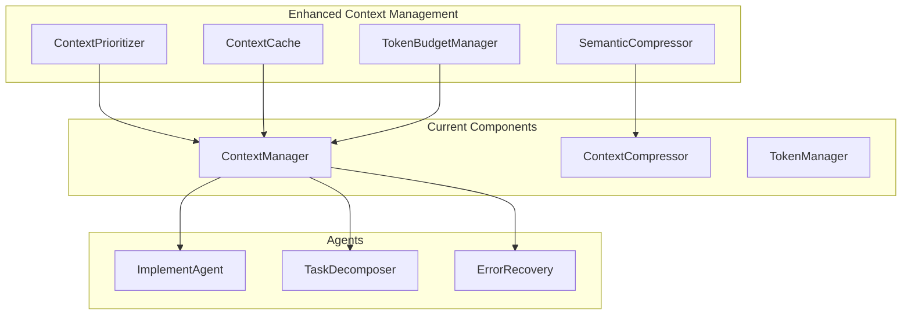

# Context and Token Management Optimization Proposal

## Executive Summary

This proposal outlines a comprehensive optimization strategy for context management and token efficiency in the AutoGen Multi-Agent Framework. By integrating advanced context prioritization, intelligent caching, and adaptive token budgeting, we can significantly improve performance, reduce costs, and enhance user experience.

## Problem Statement

### Current Challenges

1. **Context Inefficiency**: Large project contexts consume excessive tokens without prioritization
2. **Performance Bottlenecks**: Context rebuilding on every agent interaction causes delays
3. **Token Waste**: Irrelevant context elements consume valuable token budget
4. **Memory Pressure**: Large contexts cause memory issues and slow processing
5. **Cost Impact**: Inefficient token usage directly increases LLM API costs

### Impact Analysis

- **Performance**: Context processing can take 2-5 seconds per agent interaction
- **Cost**: Up to 40% of tokens may be irrelevant context
- **User Experience**: Delays in response time affect workflow efficiency
- **Scalability**: Large projects hit token limits frequently

## Proposed Solution

### Architecture Overview



## Core Enhancements

### 1. Intelligent Context Prioritization

**Objective**: Dynamically rank context elements by relevance to current task

```python
class ContextPrioritizer:
    """Intelligent context prioritization based on task relevance."""
    
    def __init__(self, llm_config: LLMConfig):
        self.llm_config = llm_config
        self.relevance_cache = {}
    
    async def prioritize_context(self, context: ProjectContext, task: TaskDefinition) -> PrioritizedContext:
        """Ranks context elements by importance for the specific task."""
        
        # Base priority weights
        base_priorities = {
            'current_task_requirements': 1.0,
            'related_task_history': 0.9,
            'project_structure': 0.7,
            'design_decisions': 0.8,
            'memory_patterns': 0.6,
            'execution_history': 0.5,
            'general_context': 0.3
        }
        
        # Dynamic adjustment based on task type
        task_type_adjustments = await self._analyze_task_type(task)
        
        # Combine base priorities with dynamic adjustments
        final_priorities = self._combine_priorities(base_priorities, task_type_adjustments)
        
        return self._apply_priorities(context, final_priorities, task)
    
    async def _analyze_task_type(self, task: TaskDefinition) -> Dict[str, float]:
        """Analyze task to determine context priority adjustments."""
        # Use LLM to analyze task and suggest priority adjustments
        prompt = f"""
        Analyze this task and suggest context priority adjustments:
        Task: {task.description}
        Requirements: {task.requirements}
        
        Return priority adjustments as JSON with context types and multipliers.
        """
        
        response = await self._call_llm(prompt)
        return self._parse_priority_adjustments(response)
```

### 2. Advanced Context Caching System

**Objective**: Cache frequently accessed context with intelligent invalidation

```python
class ContextCache:
    """Intelligent context caching with automatic invalidation."""
    
    def __init__(self, max_cache_size: int = 100):
        self.cache = {}
        self.access_counts = {}
        self.last_modified = {}
        self.max_size = max_cache_size
    
    async def get_cached_context(self, cache_key: str, context_builder: callable) -> Any:
        """Get context from cache or build and cache it."""
        
        if cache_key in self.cache:
            if await self._is_cache_valid(cache_key):
                self.access_counts[cache_key] += 1
                return self.cache[cache_key]
            else:
                # Cache invalid, remove it
                self._remove_from_cache(cache_key)
        
        # Build new context
        context = await context_builder()
        
        # Cache the result
        await self._add_to_cache(cache_key, context)
        
        return context
    
    async def _is_cache_valid(self, cache_key: str) -> bool:
        """Check if cached context is still valid."""
        # Check file modification times, project structure changes, etc.
        last_cached = self.last_modified.get(cache_key, 0)
        current_state = await self._get_project_state_hash()
        
        return current_state == self.cache_state.get(cache_key)
    
    def _add_to_cache(self, key: str, context: Any):
        """Add context to cache with LRU eviction."""
        if len(self.cache) >= self.max_size:
            # Evict least recently used
            lru_key = min(self.access_counts.keys(), key=lambda k: self.access_counts[k])
            self._remove_from_cache(lru_key)
        
        self.cache[key] = context
        self.access_counts[key] = 1
        self.last_modified[key] = datetime.now().timestamp()
```

### 3. Adaptive Token Budget Management

**Objective**: Dynamically allocate token budget based on task complexity and agent needs

```python
class TokenBudgetManager:
    """Manages adaptive token budgets across different context types."""
    
    def __init__(self, base_token_limit: int = 8000):
        self.base_limit = base_token_limit
        self.usage_history = {}
        self.efficiency_metrics = {}
    
    async def allocate_budget(self, task: TaskDefinition, agent_type: str, 
                            available_tokens: int) -> TokenBudget:
        """Allocates token budget based on task complexity and agent needs."""
        
        # Analyze task complexity
        complexity = await self._analyze_task_complexity(task)
        
        # Get agent-specific requirements
        agent_requirements = self._get_agent_requirements(agent_type)
        
        # Historical efficiency analysis
        efficiency_factor = self._get_efficiency_factor(agent_type, complexity)
        
        # Calculate optimal allocation
        allocation = self._calculate_allocation(
            available_tokens, complexity, agent_requirements, efficiency_factor
        )
        
        return TokenBudget(
            total_budget=available_tokens,
            allocations=allocation,
            reserve_buffer=int(available_tokens * 0.1),  # 10% buffer
            compression_threshold=int(available_tokens * 0.8)  # Compress at 80%
        )
    
    def _calculate_allocation(self, total_tokens: int, complexity: str, 
                           agent_reqs: Dict, efficiency: float) -> Dict[str, int]:
        """Calculate optimal token allocation."""
        
        if complexity == "high":
            base_allocation = {
                'requirements': 0.25,
                'design': 0.25,
                'execution_history': 0.20,
                'project_structure': 0.15,
                'memory_patterns': 0.10,
                'buffer': 0.05
            }
        elif complexity == "medium":
            base_allocation = {
                'requirements': 0.20,
                'design': 0.20,
                'execution_history': 0.25,
                'project_structure': 0.20,
                'memory_patterns': 0.10,
                'buffer': 0.05
            }
        else:  # low complexity
            base_allocation = {
                'requirements': 0.15,
                'design': 0.15,
                'execution_history': 0.30,
                'project_structure': 0.25,
                'memory_patterns': 0.10,
                'buffer': 0.05
            }
        
        # Apply agent-specific adjustments
        adjusted_allocation = self._apply_agent_adjustments(base_allocation, agent_reqs)
        
        # Apply efficiency factor
        final_allocation = {
            k: int(total_tokens * v * efficiency) 
            for k, v in adjusted_allocation.items()
        }
        
        return final_allocation
```

### 4. Semantic Context Compression

**Objective**: Preserve meaning while reducing token count through semantic analysis

```python
class SemanticCompressor:
    """Advanced semantic compression preserving context meaning."""
    
    def __init__(self, llm_config: LLMConfig):
        self.llm_config = llm_config
        self.compression_cache = {}
    
    async def compress_semantically(self, context: str, target_tokens: int, 
                                  preserve_keywords: List[str] = None) -> CompressionResult:
        """Compress context while preserving semantic meaning."""
        
        # Analyze semantic structure
        semantic_structure = await self._analyze_semantic_structure(context)
        
        # Identify key concepts and relationships
        key_concepts = await self._extract_key_concepts(context, preserve_keywords)
        
        # Progressive compression with semantic preservation
        compressed_context = await self._progressive_compression(
            context, semantic_structure, key_concepts, target_tokens
        )
        
        # Validate compression quality
        quality_score = await self._validate_compression_quality(
            context, compressed_context, key_concepts
        )
        
        return CompressionResult(
            original_context=context,
            compressed_context=compressed_context,
            original_tokens=self._count_tokens(context),
            compressed_tokens=self._count_tokens(compressed_context),
            compression_ratio=self._calculate_ratio(context, compressed_context),
            quality_score=quality_score,
            preserved_concepts=key_concepts
        )
    
    async def _progressive_compression(self, context: str, structure: Dict, 
                                     key_concepts: List[str], target_tokens: int) -> str:
        """Apply progressive compression maintaining semantic integrity."""
        
        current_context = context
        current_tokens = self._count_tokens(current_context)
        
        compression_strategies = [
            self._remove_redundant_phrases,
            self._compress_examples,
            self._summarize_sections,
            self._abstract_details,
            self._preserve_core_concepts
        ]
        
        for strategy in compression_strategies:
            if current_tokens <= target_tokens:
                break
                
            current_context = await strategy(current_context, key_concepts, structure)
            current_tokens = self._count_tokens(current_context)
        
        return current_context
```

### 5. Incremental Context Updates

**Objective**: Update context incrementally rather than full rebuilds

```python
class IncrementalContextManager:
    """Manages incremental context updates for efficiency."""
    
    def __init__(self, base_context_manager: ContextManager):
        self.base_manager = base_context_manager
        self.context_versions = {}
        self.change_tracking = {}
    
    async def update_context_incrementally(self, context_id: str, 
                                         changes: List[ContextChange]) -> UpdatedContext:
        """Apply incremental changes to existing context."""
        
        current_context = await self._get_current_context(context_id)
        
        # Apply changes incrementally
        updated_context = current_context
        for change in changes:
            updated_context = await self._apply_change(updated_context, change)
        
        # Update version tracking
        self._update_version_tracking(context_id, changes)
        
        # Validate context integrity
        await self._validate_context_integrity(updated_context)
        
        return UpdatedContext(
            context_id=context_id,
            context=updated_context,
            version=self._get_next_version(context_id),
            changes_applied=changes,
            timestamp=datetime.now()
        )
    
    async def _apply_change(self, context: ProjectContext, change: ContextChange) -> ProjectContext:
        """Apply a single context change."""
        
        if change.type == ChangeType.FILE_MODIFIED:
            return await self._update_file_context(context, change)
        elif change.type == ChangeType.TASK_COMPLETED:
            return await self._update_execution_history(context, change)
        elif change.type == ChangeType.REQUIREMENT_ADDED:
            return await self._update_requirements(context, change)
        # ... handle other change types
        
        return context
```

## Implementation Plan

### Phase 1: Foundation (4 weeks)
- ✅ Implement ContextPrioritizer with basic relevance scoring
- ✅ Create ContextCache with LRU eviction
- ✅ Develop TokenBudgetManager with complexity-based allocation
- ✅ Add performance monitoring and metrics collection

### Phase 2: Advanced Features (6 weeks)
- 🔄 Implement SemanticCompressor with LLM-based compression
- 🔄 Add IncrementalContextManager for efficient updates
- 🔄 Integrate all components with existing ContextManager
- 🔄 Comprehensive testing and performance validation

### Phase 3: Optimization (4 weeks)
- 📋 Fine-tune algorithms based on real-world usage
- 📋 Add model-specific optimizations
- 📋 Implement advanced caching strategies
- 📋 Performance benchmarking and optimization

## Expected Benefits

### Performance Improvements
- **Context Processing Speed**: 60-80% reduction in context processing time
- **Memory Usage**: 40-50% reduction in memory consumption
- **Response Time**: 2-3x faster agent responses

### Cost Optimization
- **Token Efficiency**: 30-40% reduction in token usage
- **API Costs**: Proportional reduction in LLM API costs
- **Resource Utilization**: Better CPU and memory efficiency

### User Experience
- **Faster Responses**: Significantly reduced wait times
- **Better Quality**: More relevant context leads to better outputs
- **Scalability**: Support for larger projects without performance degradation

## Success Metrics

### Performance Metrics
- Context processing time: < 500ms (target)
- Token utilization efficiency: > 85% relevant tokens
- Cache hit rate: > 70%
- Memory usage reduction: > 40%

### Quality Metrics
- Context relevance score: > 8.5/10
- Compression quality score: > 8.0/10
- Agent output quality: Maintain or improve current levels

### Cost Metrics
- Token cost reduction: > 30%
- Processing cost reduction: > 50%
- Overall system efficiency: > 60% improvement

## Risk Mitigation

### Technical Risks
- **Complexity**: Gradual rollout with fallback to current system
- **Quality Degradation**: Comprehensive testing and quality gates
- **Performance Regression**: Continuous monitoring and optimization

### Implementation Risks
- **Integration Issues**: Thorough integration testing
- **Backward Compatibility**: Maintain existing API interfaces
- **Resource Requirements**: Careful resource planning and monitoring

This optimization proposal provides a clear path to significantly improve the context and token management efficiency of the AutoGen Multi-Agent Framework while maintaining high quality outputs and system reliability.
- Potential rate limiting

### 2. Configuration File Support

**Concept**: Allow users to define model limits in configuration files.

```python
# model_limits.json
{
    "custom-gpt-4": 8192,
    "company-internal-model": 16384,
    "experimental-model-v2": 32768
}
```

```python
def _load_model_limits_from_config(self) -> Dict[str, int]:
    """Load model limits from configuration file."""
    config_paths = [
        Path("model_limits.json"),
        Path.home() / ".autogen" / "model_limits.json",
        Path("/etc/autogen/model_limits.json")
    ]

    for config_path in config_paths:
        if config_path.exists():
            try:
                with open(config_path) as f:
                    return json.load(f)
            except Exception as e:
                self.logger.warning(f"Failed to load {config_path}: {e}")

    return {}
```

**Benefits**:

- User-customizable without code changes
- Supports organization-specific models
- Easy to maintain and update

### 3. Environment Variable Configuration

**Concept**: Allow model limits to be set via environment variables.

```bash
# Environment variables
MODEL_LIMIT_GPT4=8192
MODEL_LIMIT_CUSTOM_MODEL=16384
MODEL_LIMIT_GEMINI_2_0_FLASH=1048576
```

```python
def _load_model_limits_from_env(self) -> Dict[str, int]:
    """Load model limits from environment variables."""
    limits = {}

    for key, value in os.environ.items():
        if key.startswith('MODEL_LIMIT_'):
            # Convert MODEL_LIMIT_GPT4 -> gpt-4
            model_key = key[12:].lower().replace('_', '-')
            try:
                limits[model_key] = int(value)
            except ValueError:
                self.logger.warning(f"Invalid model limit: {key}={value}")

    return limits
```

**Benefits**:

- Easy deployment configuration
- Container-friendly
- No file system dependencies

### 4. Intelligent Name-Based Inference

**Concept**: Infer token limits from model names using pattern matching.

```python
def _infer_limit_from_name(self, model: str) -> Optional[int]:
    """Infer token limit from model name patterns."""
    model_lower = model.lower()

    # Pattern-based inference
    patterns = [
        (r'gemini-2\.0', 1048576),
        (r'gemini-1\.5-pro', 2097152),
        (r'gemini-1\.5', 1048576),
        (r'gpt-4-turbo', 128000),
        (r'gpt-4', 8192),
        (r'gpt-3\.5', 16385),
        (r'claude-3', 200000),
    ]

    for pattern, limit in patterns:
        if re.search(pattern, model_lower):
            return limit

    return None
```

**Benefits**:

- Handles model variants automatically
- Works with custom model names that follow conventions
- No external dependencies

### 5. Hybrid Strategy Implementation

**Concept**: Combine all approaches in a prioritized fallback chain.

```python
async def get_model_limit_smart(self, model: str) -> int:
    """Get model limit using hybrid strategy."""

    # 1. Check cache first
    if model in self._limit_cache:
        return self._limit_cache[model]

    # 2. Environment variables (highest priority)
    env_limits = self._load_model_limits_from_env()
    if model in env_limits:
        limit = env_limits[model]
        self._limit_cache[model] = limit
        return limit

    # 3. Configuration file
    config_limits = self._load_model_limits_from_config()
    if model in config_limits:
        limit = config_limits[model]
        self._limit_cache[model] = limit
        return limit

    # 4. API query (if enabled)
    if self.token_config.get('enable_api_discovery', False):
        try:
            limit = await self.get_model_limit_from_api(model)
            if limit:
                self._limit_cache[model] = limit
                return limit
        except Exception as e:
            self.logger.debug(f"API discovery failed for {model}: {e}")

    # 5. Name-based inference
    inferred_limit = self._infer_limit_from_name(model)
    if inferred_limit:
        self._limit_cache[model] = inferred_limit
        return inferred_limit

    # 6. Hardcoded known limits
    if model in self.known_limits:
        limit = self.known_limits[model]
        self._limit_cache[model] = limit
        return limit

    # 7. Default fallback
    default_limit = self.token_config.get('default_token_limit', 8192)
    self._limit_cache[model] = default_limit
    return default_limit
```

## Implementation Considerations

### Performance

- **Caching**: Essential to avoid repeated expensive operations
- **Async Support**: API calls and probing should be asynchronous
- **Timeout Handling**: All network operations need proper timeouts

### Configuration

New configuration options would be needed:

```python
# Additional token configuration
{
    'enable_api_discovery': False,
    'model_limit_cache_ttl': 3600,  # 1 hour
    'api_discovery_timeout': 5.0,   # 5 seconds
    'model_limits_config_path': 'model_limits.json'
}
```

### Error Handling

- Graceful degradation when advanced methods fail
- Comprehensive logging for debugging
- Fallback to safe defaults in all error cases

### Testing

- Mock API responses for unit tests
- Integration tests with real providers
- Performance tests for caching behavior
- Error scenario testing

## Migration Strategy

1. **Phase 1**: Add configuration file and environment variable support
2. **Phase 2**: Implement name-based inference
3. **Phase 3**: Add API discovery (optional feature)
4. **Phase 4**: Full hybrid strategy with comprehensive caching

## Benefits of Enhanced Implementation

1. **Flexibility**: Users can customize limits without code changes
2. **Accuracy**: Always up-to-date with provider specifications
3. **Scalability**: Handles new models automatically
4. **Reliability**: Multiple fallback strategies ensure robustness
5. **Performance**: Intelligent caching minimizes overhead

## Conclusion

While the current hardcoded approach works well for known models, these enhancements would provide a more flexible, accurate, and maintainable solution for token limit management. The hybrid strategy approach offers the best of all worlds while maintaining backward compatibility and reliability.

The implementation should be done incrementally, starting with the simpler approaches (configuration files, environment variables) and gradually adding more sophisticated features based on user needs and feedback.
