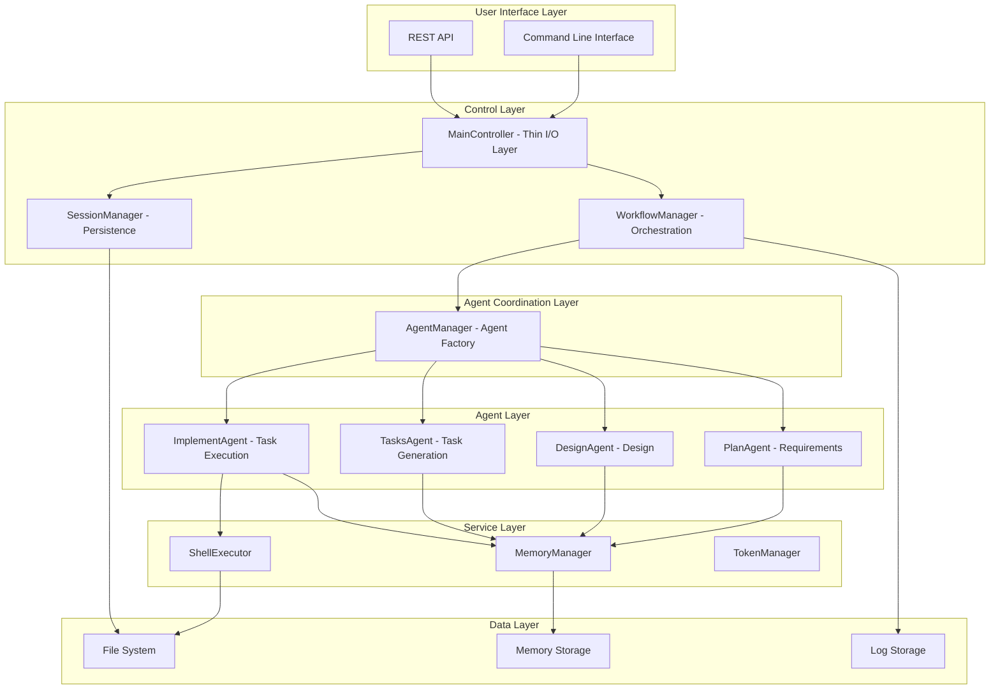

# AutoGen Framework Developer Guide

This guide is for developers who want to understand, extend, or contribute to the AutoGen Multi-Agent Framework.

## 🏗️ Architecture Overview

### Core Design Principles

1.  **Modular Design**: Each component has clear responsibilities and interfaces.
2.  **Async First**: All I/O operations use asynchronous mode.
3.  **Fault Tolerance**: Comprehensive error handling and recovery mechanisms.
4.  **Scalability**: Easy to add new agents and features.
5.  **Observability**: Detailed logging and state tracking.

### System Architecture Diagram



## 📦 Core Component Details

### 1. MainController (Refactored)

**Responsibilities**: Thin input/output layer that delegates to specialized managers.

```python
class MainController:
    """
    The main controller is now a thin delegation layer responsible for:
    - Framework initialization
    - Translating user commands to manager calls
    - Result formatting and presentation
    """
    
    def __init__(self, workspace_path: str, llm_config: LLMConfig):
        self.workspace_path = Path(workspace_path)
        self.llm_config = llm_config
        self.session_manager = SessionManager(workspace_path)
        self.agent_manager = AgentManager(llm_config)
        self.workflow_manager = WorkflowManager(self.agent_manager, self.session_manager)
    
    async def initialize_framework(self) -> bool:
        """Initializes the framework components."""
        # Delegate to managers
        pass
    
    async def process_request(self, request: str, auto_approve: bool = False) -> Dict[str, Any]:
        """Delegates request processing to WorkflowManager."""
        return await self.workflow_manager.process_request(request, auto_approve)
```

**Key Methods**:
- `initialize_framework()`: Initializes top-level managers.
- `process_request()`: Delegates to WorkflowManager.
- `approve_phase()`: Delegates to WorkflowManager.
- `apply_phase_revision()`: Delegates to WorkflowManager.

### 2. AgentManager (Updated)

**Responsibilities**: Agent factory and coordination, now includes TasksAgent.

```python
class AgentManager:
    """
    The agent manager is responsible for:
    - Agent initialization (including new TasksAgent)
    - Inter-agent coordination
    - Task distribution
    - Result aggregation
    """
    
    def __init__(self, llm_config: LLMConfig):
        self.llm_config = llm_config
        self.agents: Dict[str, BaseLLMAgent] = {}
    
    async def setup_agents(self) -> None:
        """Sets up all agents including the new TasksAgent."""
        self.agents["plan"] = PlanAgent(
            name="PlanAgent",
            llm_config=self.llm_config,
            system_message=self._get_plan_agent_system_message()
        )
        self.agents["design"] = DesignAgent(
            name="DesignAgent", 
            llm_config=self.llm_config,
            system_message=self._get_design_agent_system_message()
        )
        self.agents["tasks"] = TasksAgent(
            name="TasksAgent",
            llm_config=self.llm_config,
            system_message=self._get_tasks_agent_system_message()
        )
        self.agents["implement"] = ImplementAgent(
            name="ImplementAgent",
            llm_config=self.llm_config,
            system_message=self._get_implement_agent_system_message()
        )
    
    async def coordinate_agents(
        self, 
        task_type: str, 
        context: Dict[str, Any]
    ) -> Dict[str, Any]:
        """Coordinates agents to execute tasks."""
        # Routes task generation to TasksAgent, execution to ImplementAgent
        pass
```

### 3. BaseLLMAgent

**Responsibilities**: The base class for all AI agents, providing common functionality.

```python
class BaseLLMAgent:
    """
    The base agent class provides:
    - LLM integration
    - Context management
    - Error handling
    - Logging
    """
    
    def __init__(
        self, 
        name: str, 
        llm_config: LLMConfig, 
        system_message: str
    ):
        self.name = name
        self.llm_config = llm_config
        self.system_message = system_message
        self.context: Dict[str, Any] = {}
        self.logger = logging.getLogger(f"autogen_framework.agents.{name}")
    
    async def generate_response(
        self, 
        prompt: str, 
        context: Optional[Dict[str, Any]] = None
    ) -> str:
        """Generates an LLM response."""
        # Implement LLM call logic
        pass
    
    def update_context(self, new_context: Dict[str, Any]) -> None:
        """Updates the agent's context."""
        self.context.update(new_context)
```

### 3. SessionManager (New Component)

**Responsibilities**: Dedicated session persistence and management.

```python
class SessionManager:
    """
    The session manager is responsible for:
    - Session state persistence
    - Session loading and creation
    - Session reset operations
    - Session ID management
    """
    
    def __init__(self, workspace_path: str):
        self.workspace_path = Path(workspace_path)
        self.session_file = self.workspace_path / "memory" / "session_state.json"
    
    def load_or_create_session(self) -> Dict[str, Any]:
        """Loads existing session or creates new one."""
        pass
    
    def save_session_state(self, session_data: Dict[str, Any]) -> bool:
        """Saves session state to disk."""
        pass
    
    def reset_session(self) -> bool:
        """Resets session data."""
        pass
```

### 4. WorkflowManager (New Component)

**Responsibilities**: Central workflow orchestration and business logic.

```python
class WorkflowManager:
    """
    The workflow manager is responsible for:
    - Workflow orchestration
    - Phase management and approvals
    - State transitions
    - Auto approve mode handling
    """
    
    def __init__(self, agent_manager: AgentManager, session_manager: SessionManager):
        self.agent_manager = agent_manager
        self.session_manager = session_manager
        self.workflow_state = None
    
    async def process_request(self, user_request: str, auto_approve: bool = False) -> Dict[str, Any]:
        """Processes user request through the workflow."""
        pass
    
    async def continue_workflow(self) -> Dict[str, Any]:
        """Continues existing workflow."""
        pass
    
    def approve_phase(self, phase: str, approved: bool = True) -> Dict[str, Any]:
        """Approves or rejects a workflow phase."""
        pass
    
    async def apply_phase_revision(self, phase: str, revision_feedback: str) -> Dict[str, Any]:
        """Applies revision feedback to a phase."""
        pass
```

### 5. Specialized Agent Implementations

#### PlanAgent
```python
class PlanAgent(BaseLLMAgent):
    """
    The plan agent is responsible for:
    - Requirements analysis
    - Requirements document generation
    - Work directory creation
    """
    
    async def parse_user_request(self, request: str) -> Dict[str, Any]:
        """Parses the user request."""
        pass
    
    async def generate_requirements(
        self, 
        request: str, 
        work_dir: str
    ) -> str:
        """Generates a requirements document."""
        pass
```

#### DesignAgent
```python
class DesignAgent(BaseLLMAgent):
    """
    The design agent is responsible for:
    - Technical design
    - Architecture planning
    - Design document generation
    """
    
    async def generate_design(
        self, 
        requirements: str, 
        work_dir: str
    ) -> str:
        """Generates a design document."""
        pass
    
    async def create_architecture_diagram(
        self, 
        design: str
    ) -> str:
        """Creates an architecture diagram."""
        pass
```

#### TasksAgent (New Agent)
```python
class TasksAgent(BaseLLMAgent):
    """
    The tasks agent is responsible for:
    - Task decomposition from design documents
    - Task list generation (tasks.md)
    - Task planning and sequencing
    """
    
    async def generate_task_list(
        self, 
        design_path: str,
        requirements_path: str, 
        work_dir: str
    ) -> str:
        """Generates a task list from design document."""
        pass
    
    async def process_task(self, task_input: Dict[str, Any]) -> Dict[str, Any]:
        """Processes task generation requests."""
        pass
```

#### ImplementAgent (Refactored)
```python
class ImplementAgent(BaseLLMAgent):
    """
    The implement agent is now a pure executor responsible for:
    - Task execution only (no task generation)
    - Code generation and implementation
    - Patch strategy application
    - Error recovery and retry mechanisms
    """
    
    async def execute_task(
        self, 
        task: TaskDefinition, 
        work_dir: str
    ) -> Dict[str, Any]:
        """Executes a specific task."""
        pass
    
    async def execute_multiple_tasks(
        self, 
        tasks_file: str, 
        work_dir: str
    ) -> Dict[str, Any]:
        """Executes multiple tasks from tasks.md."""
        pass
    
    async def execute_with_patch_strategy(
        self, 
        task: TaskDefinition, 
        work_dir: str
    ) -> Dict[str, Any]:
        """Executes a task using the patch strategy."""
        pass
```

## 🔧 Core Feature Implementation

### 1. Patch Strategy System

The patch strategy is one of the core innovations of the framework, providing an intelligent file modification mechanism.

```python
# Core flow
async def execute_with_patch_strategy(self, task, work_dir):
    # 1. Identify files to be modified
    files_to_modify = await self._identify_files_for_modification(task, work_dir)
    
    # 2. Create backups
    backup_results = await self._create_file_backups(files_to_modify, work_dir)
    
    # 3. Generate new content
    generated_content = await self.generate_response(prompt, context)
    
    # 4. Apply patch
    patch_results = await self._apply_patch_first_modifications(
        files_to_modify, generated_content, work_dir
    )
    
    # 5. Verify modifications
    verification_result = await self._verify_patch_modifications(task, work_dir)
    
    # 6. If failed, restore from backup
    if not verification_result["success"]:
        await self._restore_from_backups(backup_results["backups_created"], work_dir)
```

**Key Features**:
- **Intelligent file identification**: Automatically identifies files that need to be modified.
- **Secure backup mechanism**: Automatically creates backups before modification.
- **Patch-first**: Uses diff/patch commands for precise modifications.
- **Fallback mechanism**: Automatically switches to full overwrite if patching fails.
- **Automatic verification**: Automatically verifies syntax and functionality after modification.
- **Error recovery**: Automatically restores from backup on failure.

### 2. Memory System

The memory system provides context retention and learning capabilities.

```python
class MemoryManager:
    """
    The memory manager provides:
    - Context storage
    - Learning log
    - Knowledge retrieval
    """
    
    def __init__(self, workspace_path: str):
        self.workspace_path = Path(workspace_path)
        self.memory_dir = self.workspace_path / "memory"
        self.global_memory_dir = Path.home() / ".autogen_framework" / "memory"
    
    async def load_memory(self, context_type: str) -> Dict[str, Any]:
        """Loads memory content."""
        pass
    
    async def save_memory(
        self, 
        context_type: str, 
        content: Dict[str, Any]
    ) -> None:
        """Saves memory content."""
        pass
    
    def get_system_instructions(self) -> str:
        """Gets system instructions."""
        pass
```

**Memory Types**:
- **Project memory**: Context and learnings for a specific project.
- **Global memory**: General knowledge and experience across projects.
- **Technical memory**: Best practices for specific technology stacks.
- **Error memory**: Common errors and their solutions.

### 3. Workflow Management

```python
class WorkflowState:
    """Workflow state management."""
    
    def __init__(self):
        self.phase = WorkflowPhase.INITIAL
        self.work_directory = None
        self.approvals = {}
        self.revisions = []
        self.execution_history = []
    
    def can_proceed_to(self, target_phase: WorkflowPhase) -> bool:
        """Checks if it can proceed to the target phase."""
        pass
    
    def approve_phase(self, phase: str) -> None:
        """Approves a phase."""
        pass
    
    def add_revision(self, phase: str, feedback: str) -> None:
        """Adds a revision."""
        pass
```

## 🛠️ Extension Development

### 1. Adding a New Agent

Steps to create a new agent:

```python
# 1. Inherit from BaseLLMAgent
class CustomAgent(BaseLLMAgent):
    def __init__(self, name: str, llm_config: LLMConfig, system_message: str):
        super().__init__(name, llm_config, system_message)
        # Add custom initialization logic
    
    async def custom_method(self, input_data: Any) -> Any:
        """Implements custom functionality."""
        # Use self.generate_response() to call the LLM
        # Use self.logger to log
        # Use self.context to manage context
        pass

# 2. Register in AgentManager
class AgentManager:
    async def setup_agents(self):
        # Existing agents...
        self.agents["custom"] = CustomAgent(
            name="CustomAgent",
            llm_config=self.llm_config,
            system_message="Your custom system message"
        )

# 3. Use in coordination logic
async def coordinate_agents(self, task_type: str, context: Dict[str, Any]):
    if task_type == "custom_task":
        return await self.agents["custom"].custom_method(context)
```

### 2. Extending the Workflow

Adding a new workflow phase:

```python
# 1. Extend the WorkflowPhase enum
class WorkflowPhase(Enum):
    INITIAL = "initial"
    REQUIREMENTS = "requirements"
    DESIGN = "design"
    TASKS = "tasks"
    IMPLEMENTATION = "implementation"
    CUSTOM_PHASE = "custom_phase"  # New phase
    COMPLETED = "completed"

# 2. Update the state transition logic
def can_proceed_to(self, target_phase: WorkflowPhase) -> bool:
    transitions = {
        WorkflowPhase.INITIAL: [WorkflowPhase.REQUIREMENTS],
        WorkflowPhase.REQUIREMENTS: [WorkflowPhase.DESIGN],
        WorkflowPhase.DESIGN: [WorkflowPhase.TASKS],
        WorkflowPhase.TASKS: [WorkflowPhase.IMPLEMENTATION, WorkflowPhase.CUSTOM_PHASE],
        WorkflowPhase.CUSTOM_PHASE: [WorkflowPhase.COMPLETED],
        WorkflowPhase.IMPLEMENTATION: [WorkflowPhase.COMPLETED]
    }
    return target_phase in transitions.get(self.phase, [])

# 3. Handle the new phase in MainController
async def process_custom_phase(self, context: Dict[str, Any]) -> Dict[str, Any]:
    """Handles the custom phase."""
    # Implement custom phase logic
    pass
```

### 3. Integrating External Tools

```python
# 1. Create a tool wrapper
class ExternalToolWrapper:
    def __init__(self, tool_config: Dict[str, Any]):
        self.config = tool_config
    
    async def execute(self, command: str, context: Dict[str, Any]) -> Dict[str, Any]:
        """Executes the external tool."""
        # Implement tool integration logic
        pass

# 2. Integrate in ShellExecutor
class ShellExecutor:
    def __init__(self):
        self.external_tools = {}
    
    def register_tool(self, name: str, tool: ExternalToolWrapper):
        """Registers an external tool."""
        self.external_tools[name] = tool
    
    async def execute_with_tool(
        self, 
        tool_name: str, 
        command: str, 
        context: Dict[str, Any]
    ) -> ExecutionResult:
        """Executes a command using an external tool."""
        if tool_name in self.external_tools:
            return await self.external_tools[tool_name].execute(command, context)
        else:
            raise ValueError(f"Unknown tool: {tool_name}")
```

## 🧪 Testing Strategy

### 1. Test Architecture

```
tests/
├── unit/                    # Unit tests
│   ├── test_agents/        # Agent tests
│   ├── test_managers/      # Manager tests
│   └── test_utils/         # Utility tests
├── integration/            # Integration tests
│   ├── test_workflow/      # Workflow tests
│   ├── test_agent_coordination/  # Agent coordination tests
│   └── test_patch_strategy/      # Patch strategy tests
├── e2e/                    # End-to-end tests
│   ├── test_complete_workflow/   # Complete workflow tests
│   └── test_real_projects/       # Real project tests
└── fixtures/               # Test data
    ├── sample_requests/
    ├── expected_outputs/
    └── mock_responses/
```

### 2. Testing Best Practices

```python
# Unit test example
class TestPlanAgent:
    @pytest.fixture
    async def agent(self):
        config = LLMConfig()
        return PlanAgent(
            name="TestPlanAgent",
            llm_config=config,
            system_message="Test system message"
        )
    
    @pytest.mark.asyncio
    async def test_parse_user_request(self, agent):
        """Tests user request parsing."""
        request = "Create a simple web API"
        result = await agent.parse_user_request(request)
        
        assert result["success"] is True
        assert "api" in result["parsed_requirements"].lower()
    
    @pytest.mark.asyncio
    async def test_generate_requirements_with_mock(self, agent):
        """Tests requirements generation with a mock."""
        with patch.object(agent, 'generate_response') as mock_generate:
            mock_generate.return_value = "Mocked requirements document"
            
            result = await agent.generate_requirements("Test request", "/tmp")
            
            assert result == "Mocked requirements document"
            mock_generate.assert_called_once()

# Integration test example
class TestAgentCoordination:
    @pytest.mark.asyncio
    async def test_full_workflow_coordination(self):
        """Tests full workflow coordination."""
        # Set up test environment
        # Execute full flow
        # Verify results
        pass

# End-to-end test example
class TestRealWorldScenarios:
    @pytest.mark.asyncio
    async def test_create_simple_api(self):
        """Tests a real scenario of creating a simple API."""
        # Use real LLM calls
        # Create a temporary work directory
        # Execute full flow
        # Verify generated code
        pass
```

### 3. Mocking Strategy

```python
# LLM response mock
class MockLLMResponse:
    def __init__(self, responses: Dict[str, str]):
        self.responses = responses
        self.call_count = 0
    
    async def generate_response(self, prompt: str, context: Dict[str, Any] = None) -> str:
        self.call_count += 1
        # Return a corresponding mock response based on the prompt content
        for key, response in self.responses.items():
            if key in prompt.lower():
                return response
        return "Default mock response"

# Shell execution mock
class MockShellExecutor:
    def __init__(self, command_responses: Dict[str, ExecutionResult]):
        self.command_responses = command_responses
        self.executed_commands = []
    
    async def execute_command(self, command: str, work_dir: str) -> ExecutionResult:
        self.executed_commands.append(command)
        return self.command_responses.get(command, ExecutionResult(
            success=True,
            return_code=0,
            stdout="Mock output",
            stderr=""
        ))
```

## 📊 Performance Optimization

### 1. Asynchronous Processing Optimization

```python
# Concurrently execute independent tasks
async def execute_parallel_tasks(self, tasks: List[TaskDefinition], work_dir: str):
    """Concurrently executes independent tasks."""
    semaphore = asyncio.Semaphore(3)  # Limit concurrency
    
    async def execute_single_task(task):
        async with semaphore:
            return await self.execute_task(task, work_dir)
    
    # Identify independent tasks
    independent_tasks = self._identify_independent_tasks(tasks)
    
    # Execute concurrently
    results = await asyncio.gather(
        *[execute_single_task(task) for task in independent_tasks],
        return_exceptions=True
    )
    
    return results
```

### 2. Caching Strategy

```python
class CacheManager:
    def __init__(self):
        self.response_cache = {}
        self.file_cache = {}
    
    def get_cached_response(self, prompt_hash: str) -> Optional[str]:
        """Gets a cached LLM response."""
        return self.response_cache.get(prompt_hash)
    
    def cache_response(self, prompt_hash: str, response: str) -> None:
        """Caches an LLM response."""
        self.response_cache[prompt_hash] = response
    
    def invalidate_cache(self, pattern: str) -> None:
        """Invalidates the cache."""
        keys_to_remove = [k for k in self.response_cache.keys() if pattern in k]
        for key in keys_to_remove:
            del self.response_cache[key]
```

### 3. Memory Management

```python
class MemoryOptimizer:
    def __init__(self, max_context_size: int = 10000):
        self.max_context_size = max_context_size
    
    def optimize_context(self, context: Dict[str, Any]) -> Dict[str, Any]:
        """Optimizes the context size."""
        # Remove older context
        # Compress duplicate information
        # Retain key information
        pass
    
    def cleanup_temporary_files(self, work_dir: str) -> None:
        """Cleans up temporary files."""
        temp_patterns = ["*.tmp", "*.backup_*", "*.patch"]
        for pattern in temp_patterns:
            for file_path in Path(work_dir).glob(pattern):
                if file_path.stat().st_mtime < time.time() - 3600:  # 1 hour ago
                    file_path.unlink()
```

## 🔍 Debugging and Monitoring

### 1. Logging System

```python
# Configure structured logging
import structlog

logger = structlog.get_logger("autogen_framework")

# Use in an agent
class BaseLLMAgent:
    def __init__(self, name: str, llm_config: LLMConfig, system_message: str):
        self.logger = structlog.get_logger("autogen_framework.agents").bind(
            agent_name=name,
            agent_type=self.__class__.__name__
        )
    
    async def generate_response(self, prompt: str, context: Dict[str, Any] = None) -> str:
        self.logger.info(
            "Generating LLM response",
            prompt_length=len(prompt),
            context_keys=list(context.keys()) if context else []
        )
        
        start_time = time.time()
        try:
            response = await self._call_llm(prompt, context)
            self.logger.info(
                "LLM response generated successfully",
                response_length=len(response),
                duration=time.time() - start_time
            )
            return response
        except Exception as e:
            self.logger.error(
                "LLM response generation failed",
                error=str(e),
                duration=time.time() - start_time
            )
            raise
```

### 2. Performance Monitoring

```python
class PerformanceMonitor:
    def __init__(self):
        self.metrics = {
            "llm_calls": 0,
            "llm_total_time": 0,
            "shell_commands": 0,
            "shell_total_time": 0,
            "files_modified": 0,
            "patches_applied": 0,
            "fallbacks_used": 0
        }
    
    def record_llm_call(self, duration: float) -> None:
        """Records an LLM call."""
        self.metrics["llm_calls"] += 1
        self.metrics["llm_total_time"] += duration
    
    def record_shell_command(self, duration: float) -> None:
        """Records a shell command execution."""
        self.metrics["shell_commands"] += 1
        self.metrics["shell_total_time"] += duration
    
    def get_performance_report(self) -> Dict[str, Any]:
        """Gets a performance report."""
        return {
            "llm_average_time": self.metrics["llm_total_time"] / max(1, self.metrics["llm_calls"]),
            "shell_average_time": self.metrics["shell_total_time"] / max(1, self.metrics["shell_commands"]),
            "patch_success_rate": 1 - (self.metrics["fallbacks_used"] / max(1, self.metrics["patches_applied"])),
            **self.metrics
        }
```

### 3. Error Tracking

```python
class ErrorTracker:
    def __init__(self):
        self.errors = []
    
    def record_error(
        self, 
        error: Exception, 
        context: Dict[str, Any], 
        component: str
    ) -> None:
        """Records an error."""
        error_record = {
            "timestamp": datetime.now().isoformat(),
            "component": component,
            "error_type": type(error).__name__,
            "error_message": str(error),
            "context": context,
            "traceback": traceback.format_exc()
        }
        self.errors.append(error_record)
    
    def get_error_summary(self) -> Dict[str, Any]:
        """Gets an error summary."""
        error_types = {}
        for error in self.errors:
            error_type = error["error_type"]
            error_types[error_type] = error_types.get(error_type, 0) + 1
        
        return {
            "total_errors": len(self.errors),
            "error_types": error_types,
            "recent_errors": self.errors[-5:]  # Last 5 errors
        }
```

## 🚀 Deployment and Distribution

### 1. Packaging Configuration

```toml
# pyproject.toml
[build-system]
requires = ["hatchling"]
build-backend = "hatchling.build"

[project]
name = "autogen-multi-agent-framework"
version = "1.0.0"
description = "A multi-agent framework for automated software development"
authors = [{name = "AutoGen Team", email = "team@autogen.dev"}]
license = {text = "MIT"}
readme = "README.md"
requires-python = ">=3.11"
dependencies = [
    "autogen-agentchat>=0.2.0",
    "autogen-ext[openai]>=0.2.0",
    "click>=8.0.0",
    "pydantic>=2.0.0",
    "aiofiles>=23.0.0",
    "structlog>=23.0.0",
]

[project.optional-dependencies]
dev = [
    "pytest>=7.0.0",
    "pytest-asyncio>=0.21.0",
    "black>=23.0.0",
    "isort>=5.12.0",
    "mypy>=1.0.0",
]

[project.scripts]
autogen-framework = "autogen_framework.main:main"

[tool.hatch.build.targets.wheel]
packages = ["autogen_framework"]
```

### 2. Docker Deployment

```dockerfile
# Dockerfile
FROM python:3.11-slim

WORKDIR /app

# Install system dependencies
RUN apt-get update && apt-get install -y \
    git \
    curl \
    build-essential \
    && rm -rf /var/lib/apt/lists/*

# Install uv
RUN pip install uv

# Copy project files
COPY . .

# Install dependencies
RUN uv sync --frozen

# Create a non-root user
RUN useradd -m -u 1000 autogen
USER autogen

# Set entrypoint
ENTRYPOINT ["uv", "run", "autogen-framework"]
```

### 3. CI/CD Configuration

```yaml
# .github/workflows/ci.yml
name: CI/CD Pipeline

on:
  push:
    branches: [main, develop]
  pull_request:
    branches: [main]

jobs:
  test:
    runs-on: ubuntu-latest
    strategy:
      matrix:
        python-version: ["3.11", "3.12"]
    
    steps:
      - uses: actions/checkout@v4
      
      - name: Set up Python
        uses: actions/setup-python@v4
        with:
          python-version: ${{ matrix.python-version }}
      
      - name: Install uv
        run: pip install uv
      
      - name: Install dependencies
        run: uv sync --dev
      
      - name: Run tests
        run: uv run pytest tests/ -v --cov=autogen_framework
      
      - name: Run linting
        run: |
          uv run black --check autogen_framework/
          uv run isort --check-only autogen_framework/
          uv run mypy autogen_framework/
  
  build:
    needs: test
    runs-on: ubuntu-latest
    if: github.ref == 'refs/heads/main'
    
    steps:
      - uses: actions/checkout@v4
      
      - name: Set up Python
        uses: actions/setup-python@v4
        with:
          python-version: "3.11"
      
      - name: Build package
        run: |
          pip install build
          python -m build
      
      - name: Publish to PyPI
        uses: pypa/gh-action-pypi-publish@release/v1
        with:
          password: ${{ secrets.PYPI_API_TOKEN }}
```

## 📚 API Documentation

### 1. Core API

```python
# Main API interface
class AutoGenFramework:
    """Main API interface for the framework."""
    
    def __init__(self, workspace: str, llm_config: LLMConfig):
        """Initializes the framework."""
        pass
    
    async def process_request(self, request: str) -> WorkflowResult:
        """Handles a user request."""
        pass
    
    async def approve_phase(self, phase: str) -> bool:
        """Approves a workflow phase."""
        pass
    
    async def revise_phase(self, phase: str, feedback: str) -> bool:
        """Revises a workflow phase."""
        pass
    
    async def execute_tasks(self) -> ExecutionResult:
        """Executes the task list."""
        pass
    
    def get_status(self) -> WorkflowStatus:
        """Gets the current status."""
        pass
```

### 2. Data Models

```python
# Core data models
@dataclass
class WorkflowResult:
    success: bool
    phase: WorkflowPhase
    work_directory: str
    generated_files: List[str]
    execution_time: float
    error: Optional[str] = None

@dataclass
class ExecutionResult:
    success: bool
    completed_tasks: int
    total_tasks: int
    failed_tasks: List[str]
    execution_time: float
    performance_metrics: Dict[str, Any]

@dataclass
class WorkflowStatus:
    current_phase: WorkflowPhase
    work_directory: Optional[str]
    approvals: Dict[str, bool]
    pending_revisions: List[str]
    execution_progress: Dict[str, Any]
```

## 🤝 Contribution Guide

### 1. Development Environment Setup

```bash
# 1. Clone the repository
git clone https://github.com/your-org/autogen-multi-agent-framework.git
cd autogen-multi-agent-framework

# 2. Set up the development environment
python -m venv venv
source venv/bin/activate  # Linux/Mac
# Or venv\Scripts\activate  # Windows

# 3. Install dependencies
pip install uv
uv sync --dev

# 4. Set up pre-commit hooks
pre-commit install

# 5. Run tests to ensure the environment is working
pytest tests/ -v
```

### 2. Code Standards

- **Code Style**: Use Black and isort.
- **Type Hinting**: Use mypy for type checking.
- **Documentation**: Use Google-style docstrings.
- **Testing**: Maintain >90% test coverage.
- **Commits**: Use Conventional Commits format.

### 3. Submission Process

1.  Create a feature branch: `git checkout -b feature/your-feature`
2.  Implement the feature and add tests.
3.  Run the full test suite: `pytest tests/ -v`
4.  Commit your changes: `git commit -m "feat: add your feature"`
5.  Push the branch: `git push origin feature/your-feature`
6.  Create a Pull Request.

---

**Maintainer**: AutoGen Framework Development Team  
**Last Updated**: 2025-08-01  
**Version**: 1.0.0
