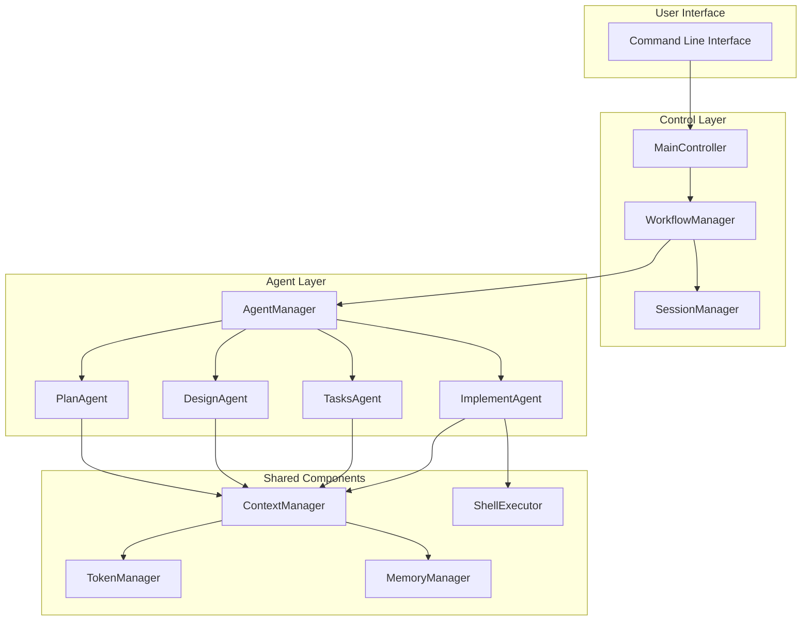
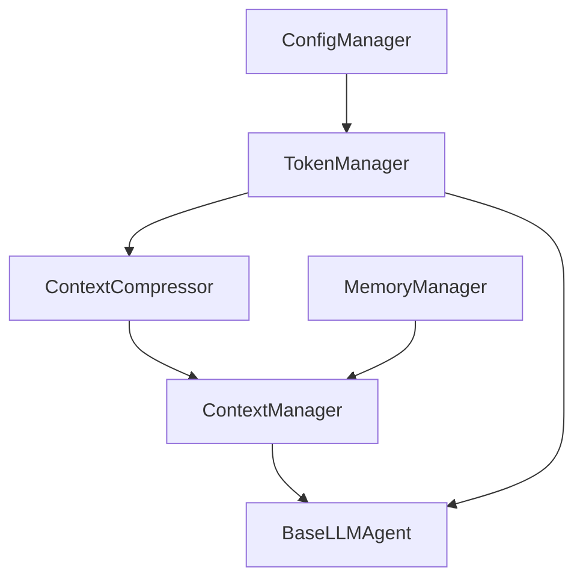

# AutoGen Framework Developer Guide

This guide is for developers who want to understand, extend, or contribute to the AutoGen Multi-Agent Framework.

## 🏗️ Architecture Overview

### Core Design Principles

1.  **Modular Design**: Each component has clear responsibilities and interfaces.
2.  **Async First**: All I/O operations use asynchronous programming.
3.  **Fault Tolerance**: Comprehensive error handling and recovery.
4.  **Scalability**: Designed for easy extension with new agents and features.
5.  **Observability**: Detailed logging and state tracking for transparency.

### System Architecture Diagram



### Core Components

- **MainController**: A thin I/O layer that handles user commands and delegates to the `WorkflowManager`.
- **WorkflowManager**: The central orchestrator that manages the development workflow (Requirements → Design → Tasks → Implementation).
- **SessionManager**: Persists and manages session state across multiple command invocations.
- **AgentManager**: A factory responsible for creating and managing all specialized agents.
- **Agents (Plan, Design, Tasks, Implement)**: Specialized agents, each responsible for a specific phase of the workflow.
- **ContextManager**: Gathers and provides relevant context to agents.
- **TokenManager**: Manages LLM token usage and optimization.
- **MemoryManager**: Provides cross-session learning and memory.
- **ShellExecutor**: Executes shell commands required by the `ImplementAgent`.

## 🔗 Dependency Injection Architecture

The framework uses a strict dependency injection pattern. Core managers (`TokenManager`, `ContextManager`) are created by the `AgentManager` and injected into every agent's constructor. This ensures that all agents share the same context and token management logic, promoting consistency and maintainability.

### Manager Dependencies



### Key Manager Responsibilities

- **TokenManager**: Handles token estimation, tracking, and compression decisions.
- **ContextManager**: Prepares system prompts, integrates project context, and optimizes token usage for agents.
- **ConfigManager**: Manages loading and validation of configuration from files and environment variables.

### Agent Initialization

```python
# AgentManager creates and injects dependencies into all agents.
class AgentManager:
    def setup_agents(self, llm_config: LLMConfig):
        # 1. Create managers
        config_manager = ConfigManager()
        token_manager = TokenManager(config_manager)
        context_compressor = ContextCompressor(llm_config, token_manager)
        context_manager = ContextManager(
            # ... dependencies
        )

        # 2. Inject managers into each agent
        self.plan_agent = PlanAgent(
            llm_config=llm_config,
            token_manager=token_manager,      # Injected
            context_manager=context_manager,  # Injected
        )
        # ... and so on for all other agents.
```

This pattern replaces the old approach where each agent managed its own context and tokens, which led to duplicated logic.

## 📦 Core Component Details

This section would contain detailed descriptions of each component's responsibilities and key methods. For the sake of brevity in this summary, we will omit the full code snippets. Refer to the source code for detailed implementation.

- **MainController**: Translates user commands (e.g., `--request`, `--approve`) into calls to the `WorkflowManager`.
- **WorkflowManager**: Executes the main state machine of the development process.
- **AgentManager**: Contains the `setup_agents` method which is the heart of the dependency injection setup.
- **BaseLLMAgent**: The base class for all agents, which requires `TokenManager` and `_ContextManager` in its constructor.
- **Specialized Agents**: Each agent (Plan, Design, Tasks, Implement) inherits from `BaseLLMAgent` and implements the logic for its specific phase.

## 🔧 Core Features

- **Patch Strategy**: The `ImplementAgent` uses an intelligent patch-first strategy for modifying files, which includes creating backups, applying diffs, verifying changes, and rolling back on failure.
- **Memory System**: The `MemoryManager` provides context retention and learning capabilities, with project-specific and global memory stores.

## 🛠️ Extension Development

### Adding a New Agent
1.  Inherit from `BaseLLMAgent` and implement the agent's logic.
2.  Ensure the constructor accepts `token_manager` and `context_manager`.
3.  Register the new agent in `AgentManager`.
4.  Add logic to `WorkflowManager` or `AgentManager` to coordinate the new agent.

### Extending the Workflow
1.  Add a new phase to the `WorkflowPhase` enum (if necessary).
2.  Update the state transition logic in `WorkflowManager`.
3.  Implement the business logic for the new phase in `WorkflowManager`, likely calling a new or existing agent.

## 🧪 Testing Strategy

The project has a comprehensive testing strategy with unit, integration, and end-to-end tests. Please refer to `tests/README.md` for full details.

- **Unit Tests (`tests/unit/`)**: Fast and isolated, with all external dependencies mocked.
- **Integration Tests (`tests/integration/`)**: Test interactions between components and with real services (like LLM APIs).
- **E2E Tests (`tests/e2e/`)**: Test the full workflow from the command line.

---

**Maintainer**: AutoGen Framework Development Team  
**Last Updated**: 2025-08-18
**Version**: 1.0.0
